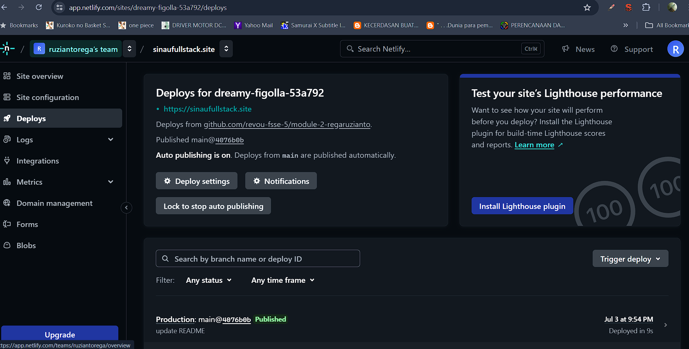

https://sinaufullstack.site/

# Deploying from GitHub to Netlify

## Prerequisites
1. **GitHub Account**: Ensure you have a GitHub account where your repository is hosted.
2. **Netlify Account**: Sign up for a Netlify account at [Netlify](https://www.netlify.com) if you haven't already.

## Steps to Deploy

### 1. Connect GitHub Repository to Netlify
- **Login to Netlify**:
  - Go to [Netlify](https://www.netlify.com) and log in using your credentials.

- **Create a New Site**:
  - Once logged in, click on **'New site from Git'** button.
  - Choose GitHub as your Git provider.
  - Authorize Netlify to access your GitHub repositories if prompted.

- **Select Repository**:
  - Netlify will display a list of your GitHub repositories.
  - Select the repository you want to deploy.

- **Configure Settings**:
  - Choose the branch you want to deploy.
  - Set the build command (if needed) and the directory where the build output resides.

- **Deploy Site**:
  - Click **'Deploy site'**.

### 2. Configure Build Settings (if required)
- Netlify will automatically detect many static site generators (like Gatsby, Hugo, Jekyll) and configure build settings accordingly.
- For more complex projects, you may need to specify build commands or environment variables in the Netlify dashboard under **'Site settings > Build & deploy'**.

### 3. Monitor Deployment
- Netlify will start building and deploying your site. You can monitor the progress in the Netlify dashboard under **'Deploys'**.
- Once the build is complete, Netlify will provide you with a unique URL (e.g., `https://your-site-name.netlify.app`) where your site is live.

### 4. Automatic Deployments (Optional)
- Enable continuous deployment to automatically deploy your site whenever you push changes to your GitHub repository:
  - Go to **'Site settings > Build & deploy > Continuous Deployment'**.
  - Set up a build hook or enable automatic builds on branch updates.

### 5. Custom Domains (Optional)
- If you have a custom domain:
  - Go to **'Site settings > Domain management'**.
  - Add your custom domain and configure DNS settings.
  - In domain hosting set up Name server from netlify

# Custom Domain Setup on Netlify

## 1. Overview
Custom domains on Netlify allow you to point your own domain name (e.g., example.com) to your Netlify-hosted website or application. This documentation will guide you through the process of setting up a custom domain on Netlify.

## 2. Prerequisites
- A registered domain name (e.g., example.com) that you own.
- Access to your domain registrar's DNS settings.
- A website or application hosted on Netlify.

## 3. Steps to Set Up a Custom Domain on Netlify
### Step 1: Access Domain Settings in Netlify
### Step 2: Add Your Custom Domain
### Step 3: Verify Domain Ownership
- Netlify will provide you with DNS records that you need to add to your domain registrar's DNS settings.
- Copy the provided DNS records (e.g., CNAME, A, or ALIAS records).

### Step 4: Update DNS Settings with Your Registrar
- Log in to your domain registrar's website.
- Find the DNS settings or DNS management section.
- Add the DNS records provided by Netlify. These typically include CNAME, A, or ALIAS records.
- Save the changes. Note that DNS changes may take some time (up to 48 hours) to propagate across the internet.

### Step 5: Verify DNS Configuration
- Return to Netlify's domain management settings.
- Click on "Verify DNS configuration" to confirm that your DNS settings have been updated correctly.
- Netlify will verify the DNS records. Once verified, your custom domain should now be connected to your Netlify site.

### Step 6: Set Your Custom Domain as Primary (Optional)
- If you want your custom domain to be the primary domain (the one users see in their browsers), select it in Netlify's domain management settings and click "Set as primary".

## 4. Troubleshooting
- **DNS Propagation**: If your domain doesn't work immediately, wait for DNS propagation (up to 48 hours) after making DNS changes.
- **Incorrect DNS Records**: Double-check the DNS records you entered with your registrar to ensure they match those provided by Netlify.
- **HTTPS Configuration**: Netlify provides free HTTPS with Let's Encrypt. Ensure HTTPS is enabled in Netlify's domain settings after domain verification.

## 5. Additional Considerations
- **Subdomains**: You can also set up subdomains (e.g., blog.example.com) using similar steps, adjusting DNS records accordingly.
- **SSL/TLS**: Netlify offers automatic SSL certificate provisioning. Ensure HTTPS is enabled for secure connections.

## 6. Conclusion
By following these steps, you can successfully set up a custom domain on Netlify, allowing you to use your own domain name with your Netlify-hosted website or application. For any issues or specific questions, refer to Netlify's detailed documentation or reach out to their support team for assistance.

## Additional Notes
- **Build Hooks**: Use build hooks to trigger builds manually or integrate with other services.
- **Environment Variables**: Manage environment variables in Netlify dashboard under **'Site settings > Build & deploy > Environment'** for secure configuration.

## Troubleshooting
- If your deployment fails, check the build logs in Netlify's dashboard for errors. Common issues include missing dependencies or misconfigured build settings.
